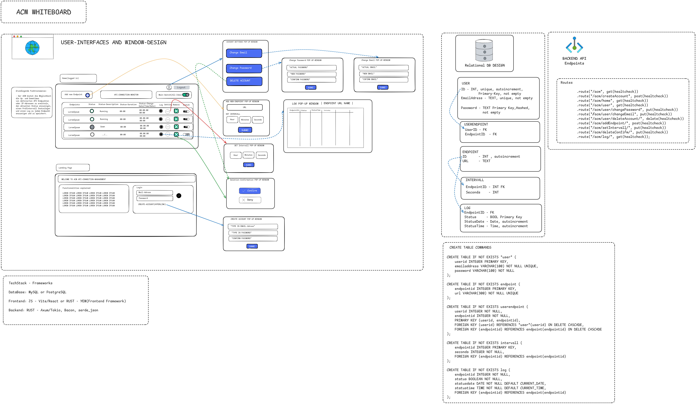

# ACM_API-Connection-Monitor

Simple Endpoint-Status-Monitoring Web-App

- Create an account
- Add the Endpoints you want to check
- Set the intervall
- See the actual status of your endpoints and review status-logs 

Creator: T.Adickes 
Github: [DevDaio](https://github.com/DevDaio/)

