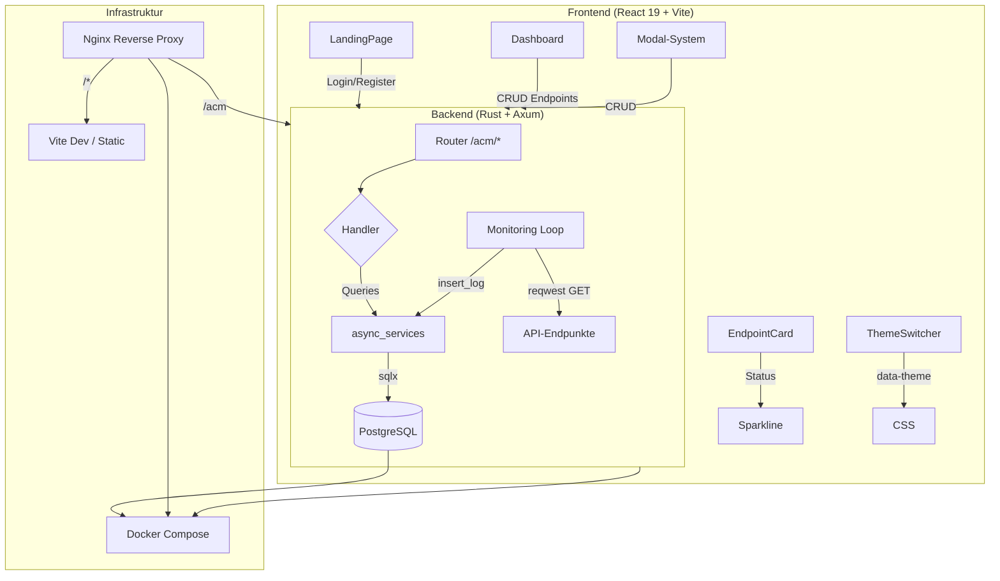

# Architektur



## Datenfluss

```
User → Browser → Nginx (:80) → /acm → Axum Backend (:3000) → sqlx → PostgreSQL
                                    → /*  → Static Files (index.html + JS)
```

## Monitoring-Loop

```
Tokio-Spawn → run_monitoring_loop()
  └─ loop (alle 5s)
       └─ get_endpoints_with_intervals()
       └─ für jeden Endpoint:
            ├─ last_checked prüfen (Intervall eingehalten?)
            ├─ reqwest GET → Status (bool)
            └─ insert_log (endpointid, status)
```

## DB-Schema

```
user (userid PK, emailadress, password)
endpoint (endpointid PK, url)
userendpoint (userid FK, endpointid FK) → M:N
intervall (endpointid PK FK, seconds)
log (endpointid FK, status, statusdate, statustime)
```
