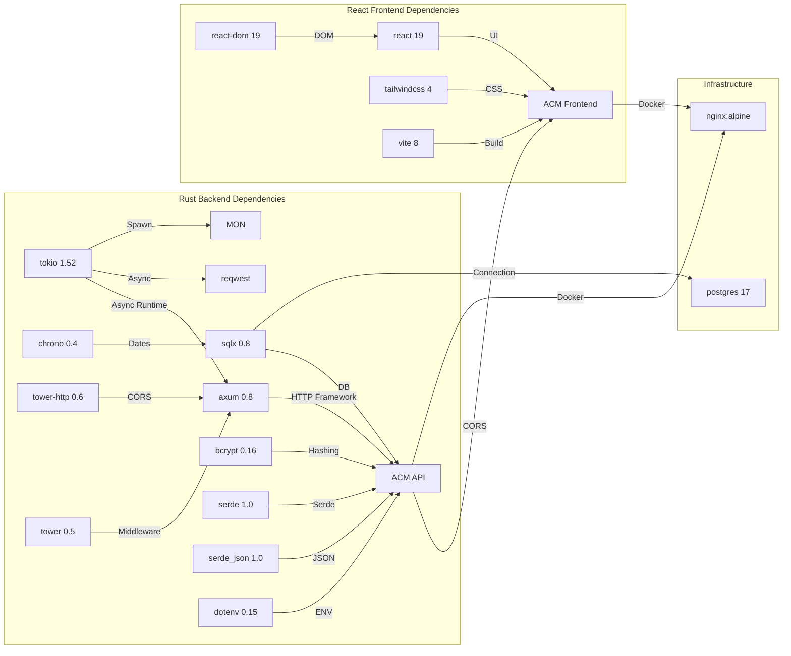

# Dependency-Graph

## Production vs Dev Dependencies

### Backend (Rust) — Production
| Crate | Version | Zweck |
|-------|---------|-------|
| axum | 0.8.9 | Async HTTP framework |
| tokio | 1.52.3 | Async runtime |
| serde | 1.0.228 | Serialisierung |
| serde_json | 1.0.149 | JSON-Handling |
| sqlx | 0.8 | PostgreSQL-Treiber |
| bcrypt | 0.16 | Passwort-Hashing |
| tower-http | 0.6 | CORS-Middleware |
| chrono | 0.4 | Datum/Zeit-Typen |
| reqwest | 0.12 | HTTP-Client für Monitoring |
| dotenv | 0.15 | .env-Laden |
| tower | 0.5 | Middleware-Layer |

### Frontend (React) — Production
| Package | Version | Zweck |
|---------|---------|-------|
| react | ^19.2.6 | UI-Library |
| react-dom | ^19.2.6 | DOM-Rendering |
| tailwindcss | ^4.3.0 | Utility-CSS |
| @tailwindcss/vite | ^4.3.0 | Tailwind Vite-Plugin |

### Frontend — Dev
| Package | Version | Zweck |
|---------|---------|-------|
| vite | ^8.0.12 | Build-Tool |
| @vitejs/plugin-react | ^6.0.1 | React-Integration |
| eslint | ^10.3.0 | Linter |
